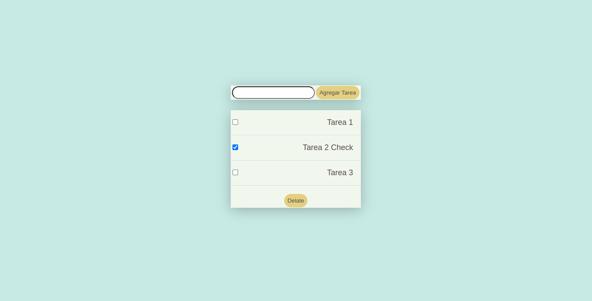

## TODO-List-App with React

<div align="center">



</div>

### Descripción

Aplicación de lista de tareas hecha con React, usando las caracteristicas basicas:
- Componentes
- Hooks de estado (useState)
- props

### Instrucciones:

Para ejecutar la aplicación ocupa los siguientes comandos:

```
npm install
```

Ejecuta la aplicación
```
npm run start
```

En caso de un error de permisos ejecuta el siguiente comando (solo si usas una distro de linux):
```
sudo chmod +x node_modules/.bin/react-scripts
```